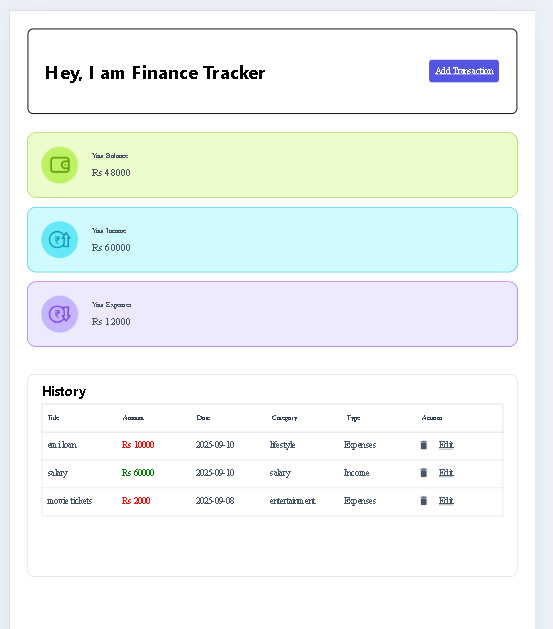
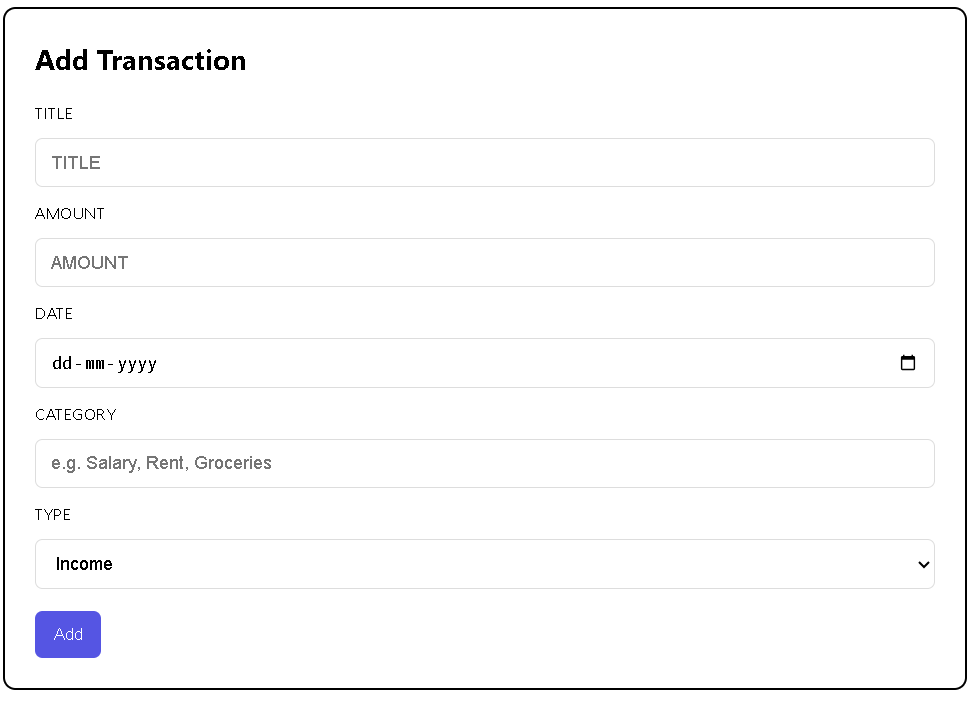
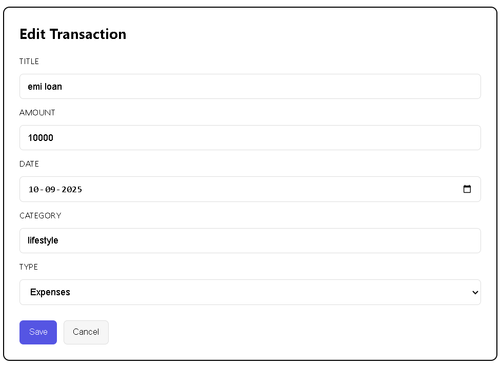
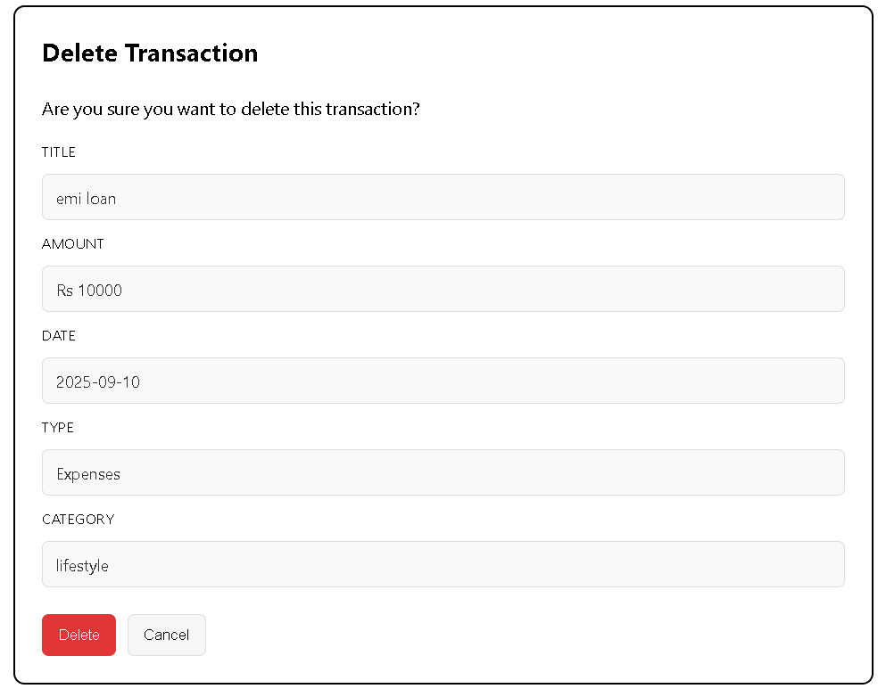

# Personal Finance Tracker (MERN)

A full-stack personal finance tracker built using the MERN stack.  
Users can add, edit, delete, and view transactions with live Balance / Income / Expenses cards.

---

# Features
-Frontend (React)
  -Routes:
    -`/` → Dashboard (Money Manager) with cards + transaction history
    -`/add` → Add Transaction
    -`/:id/edit` → Edit Transaction
    -`/:id/delete` → Delete Confirmation
  -Simple validation in UI (all fields required before submit)

-Backend (Node.js, Express, MongoDB)
  -REST API (CRUD):
    -`GET /api/transactions` — list all transactions
    -`GET /api/transactions/:id` — get single transaction
    -`POST /api/transactions` — create
    -`PUT /api/transactions/:id` — update
    -`DELETE /api/transactions/:id` — delete
  -Mongoose model with required fields:
    `title (string)`, `amount (number)`, `type ("Income"|"Expenses")`,
    `date (Date)`, `category (string)`

# Tech Stack
-Frontend: React (Create React App), React Router
-Backend:  Node.js, Express.js
-Database: MongoDB (Mongoose)

# Setup Instructions
# 1) Clone
```bash
git clone https://github.com/<your-username>/personal-finance-tracker.git
cd personal-finance-tracker
```

# 2) Backend
```bash
cd backend
cp .env.example .env   # fill values if needed
npm install
npm run dev            # http://localhost:5000
```

Example `backend/.env`:
```env
PORT=5000
MONGO_URI=mongodb://127.0.0.1:27017/finance_tracker
CLIENT_URL=http://localhost:3000
```

# 3) Frontend
```bash
cd ../frontend

npm install
npm start      
```
---
# API Reference (CRUD)

# Create
```http
POST /api/transactions
Content-Type: application/json
```
```json
{
  "title": "Salary",
  "amount": 50000,
  "type": "Income",
  "date": "2025-09-10",
  "category": "Job"
}
```

# Get all
```http
GET /api/transactions
```

# Get one
```http
GET /api/transactions/:id
```

# Update
```http
PUT /api/transactions/:id
Content-Type: application/json
```
```json
{
  "title": "Groceries - Weekend",
  "amount": 1200,
  "type": "Expenses",
  "date": "2025-09-12",
  "category": "Food"
}
```

# Delete
```http
DELETE /api/transactions/:id
```

# output-Screens
```
personal-finance-tracker/
  screenshots/
    dashboard.png
    add-transaction.png
    edit-transaction.png
    delete-transaction.png
```

Then reference them below:
#Dashboard

#Add Transaction

#Edit Transaction

#Delete Confirmation
